# Acoustic Foam Filter Equalizer

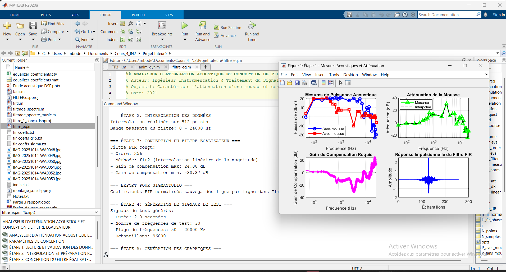

An experimental Digital Signal Processing project focused on measuring the spectral effect of acoustic foam and designing an FIR equalizer to compensate part of the observed attenuation.

This repository brings together the complete workflow: acoustic testing, audio recordings, frequency-domain analysis, MATLAB/Simulink filter design, coefficient export and SigmaStudio implementation.

> Educational DSP project — results depend on the test bench, room acoustics, microphone position and acquisition hardware.

---

## Project overview

Acoustic foam can affect an audio signal differently across the frequency spectrum. The goal of this project is to compare a reference signal with a signal measured through acoustic foam, identify attenuation regions and design an equalizer to reduce the spectral difference.

```text
Audio source
    ↓
Acoustic foam
    ↓
Microphone / acquisition system
    ↓
MATLAB spectral analysis
    ↓
FIR equalizer design
    ↓
Coefficient export
    ↓
SigmaStudio DSP implementation
    ↓
Equalized signal
```

---

## Test bench

The experimental system combines a computer, audio/DSP hardware, an acoustic foam element and a microphone-based measurement path.

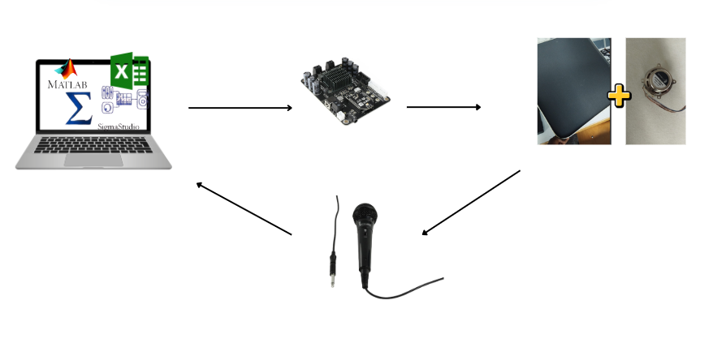

### Acoustic foam installation

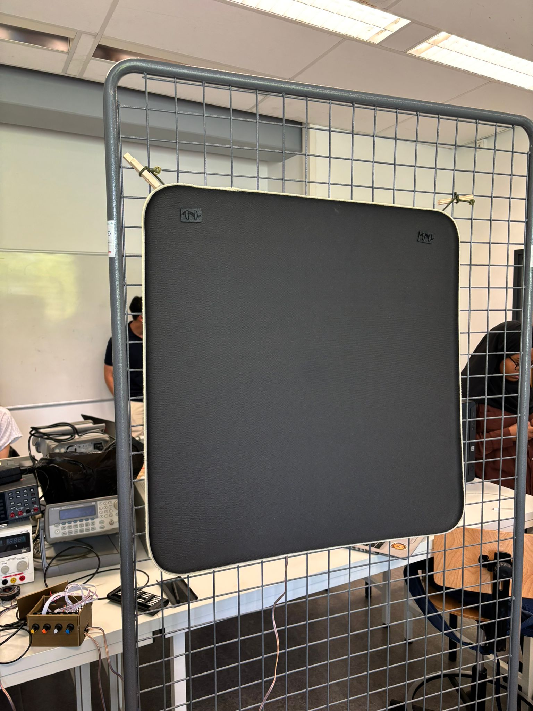

The foam panel is positioned in the acoustic propagation path for the measurement campaign.

### Acquisition and DSP hardware

| Hardware setup | Complete test environment |
|---|---|
| 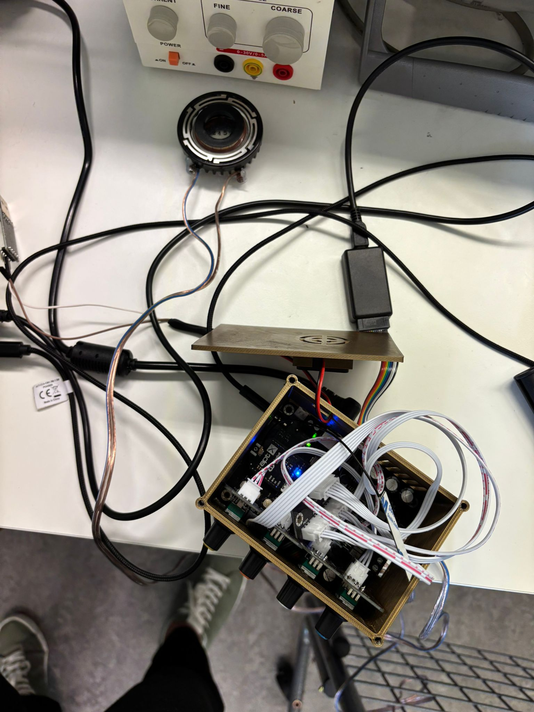 | 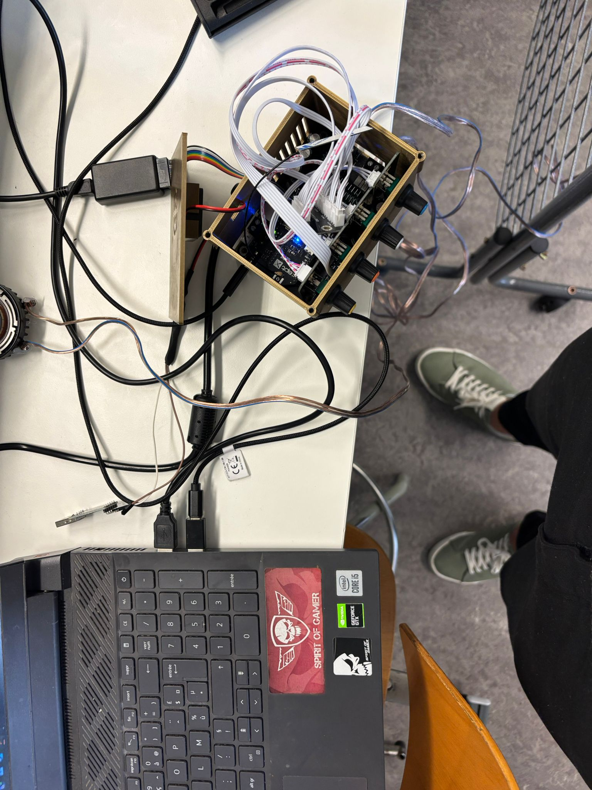 |

### Instrumentation and monitoring

| Acquisition and scope view | Attenuation measurement |
|---|---|
| 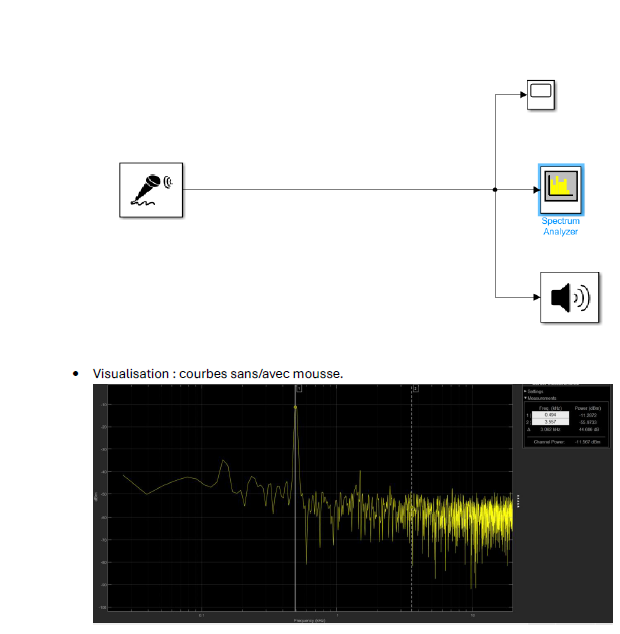 | 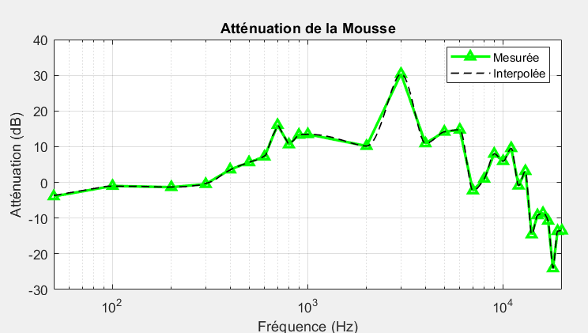 |

---

## Measurement results

The foam response is frequency dependent: it can attenuate or alter certain frequency bands more than others. The plotted attenuation response below is used as the starting point for the compensation strategy.


### Spectral comparison

The reference and foam-affected signals are compared in the frequency domain to locate resonances, reduced bands and compensation targets.

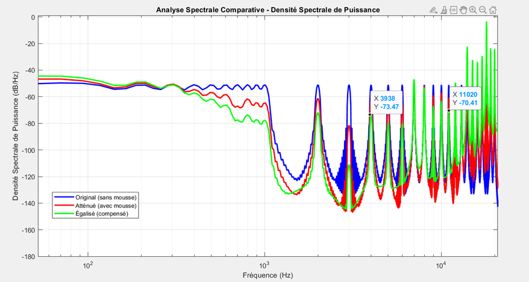

### Data acquisition

The MATLAB data-reading stage prepares the measurements for analysis and filter design.

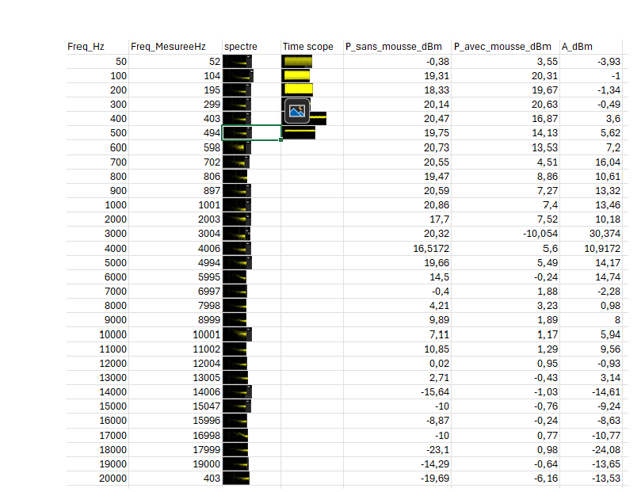

The raw spectral exports are stored in:

```text
data/raw/
├── spectre_perfect_edsheraan.csv
├── spectre_perfect_edsheraan.txt
├── spectre_perfect_edsheraan_membrane.csv
└── spectre_perfect_edsheraan_membrane.txt
```

---

## FIR equalizer design

The compensation filter is designed from the difference between the desired/reference spectrum and the spectrum measured with acoustic foam.

```text
Reference spectrum − foam-affected spectrum
                    ↓
          Required compensation curve
                    ↓
             FIR coefficient design
                    ↓
       SigmaStudio-ready coefficient export
```

An FIR filter produces each output sample by combining current and previous input samples:

$$
y[n] = \sum_{k=0}^{M-1} h[k]x[n-k]
$$

Where:

- `x[n]` is the input signal.
- `y[n]` is the equalized output.
- `h[k]` is the FIR coefficient at tap `k`.
- `M` is the filter length.

### Equalizer design result

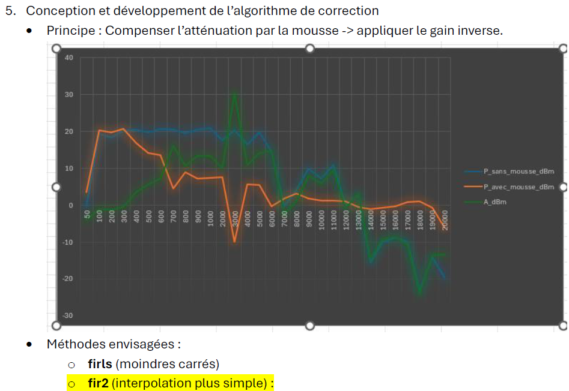

The implementation is tested in the DSP design environment shown below.

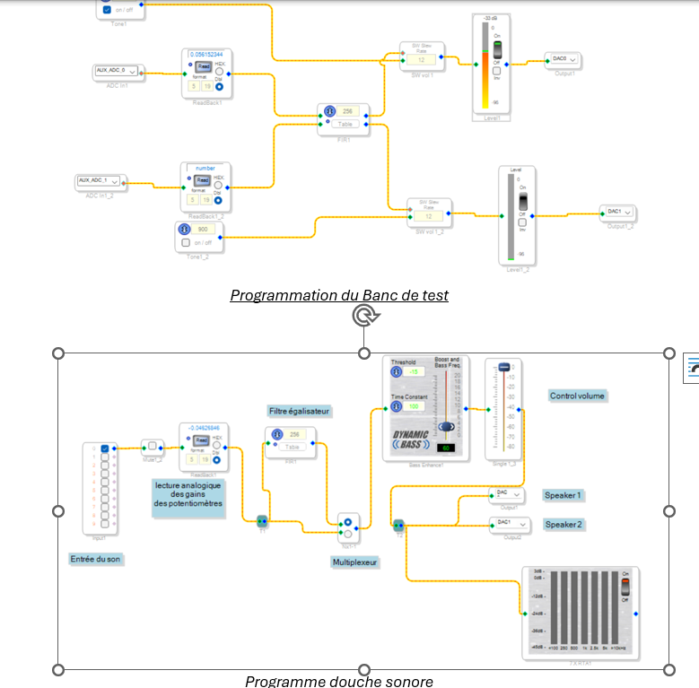

---

## MATLAB, Simulink and SigmaStudio

### MATLAB analysis

The MATLAB analysis files are located in:

```text
matlab/analysis/
├── diagram_spectral.slx
├── equalizer_coefficients.mat
├── filtr.m
├── filtrage_spectre.m
├── filtrage_spectre_music.m
└── filtre_eq.m
```

These scripts and models support spectrum visualization, frequency-response analysis, equalizer fitting and coefficient generation.

### Filter design projects

```text
matlab/filter-design/
├── banc_test.dspproj
├── diagram_spectral.slx.autosave
├── FILTER.dspproj
└── filtre_1_conçu.dspproj
```

### Exported coefficients

```text
matlab/exported-coefficients/
├── coef_fit.txt
├── coef_fit_sigma_studio.txt
├── fir_coeffs.txt
├── fir_coeffs_q15.txt
└── fir_coeffs_sigma.txt
```

| File | Content |
|---|---|
| `fir_coeffs.txt` | Floating-point FIR coefficients |
| `fir_coeffs_q15.txt` | Fixed-point Q15 FIR coefficients |
| `fir_coeffs_sigma.txt` | FIR coefficients prepared for SigmaStudio |
| `coef_fit.txt` | Fitted equalization-response data |
| `coef_fit_sigma_studio.txt` | Fitted data prepared for SigmaStudio |

---

## Audio recordings

Three recordings are available for comparison:

| File | Description |
|---|---|
| [`bruit_original.wav`](assets/audio/bruit_original.wav) | Reference signal without acoustic foam |
| [`bruit_avec_mousse.wav`](assets/audio/bruit_avec_mousse.wav) | Signal measured with acoustic foam |
| [`bruit_equalise.wav`](assets/audio/bruit_equalise.wav) | Signal after the equalization stage |

These recordings are practical experimental outputs, not calibrated reference measurements.

---

## Repository structure

```text
.
├── assets/
│   ├── audio/
│   └── images/
│       ├── compilation.png
│       ├── datasheet.png
│       ├── IMG-20251014-WA0048.jpg
│       ├── IMG-20251014-WA0049.jpg
│       ├── IMG-20251014-WA0051.jpg
│       ├── spectral_analysis.png
│       └── test_bench.png
│
├── data/
│   ├── processed/
│   │   └── reading_data.png
│   └── raw/
│
├── docs/
│   ├── datasheets/
│   │   └── TSA7802bdatasheet.pdf
│   └── reports/
│       └── rapport douche sonore.pdf
│
├── hardware/
│   ├── acoustic-test-bench/
│   │   └── test_egalizer.png
│   └── instrumentation/
│       ├── attenuation.png
│       ├── fundamental.png
│       └── test_bench.png
│
├── matlab/
│   ├── analysis/
│   ├── exported-coefficients/
│   └── filter-design/
│
└── sigmastudio/
    └── test-bench/
```

---

## Running the workflow

1. Open the project directory in MATLAB.
2. Review the input paths in the analysis scripts.
3. Run the spectrum-analysis scripts from `matlab/analysis/`.
4. Compare reference, foam-affected and equalized signals.
5. Generate or inspect FIR coefficients in `matlab/exported-coefficients/`.
6. Open the `.dspproj` files in SigmaStudio.
7. Load the FIR coefficients and test the equalizer on compatible DSP hardware.

---

## Limitations

- The test bench is experimental and not an anechoic or calibrated laboratory setup.
- Results depend on geometry, microphone position, audio source, foam placement and room reflections.
- A filter designed for one configuration may not provide the same compensation in another room or with another microphone.
- FIR equalization cannot recover frequencies that are below the noise floor.
- Strong gain compensation can increase noise or cause clipping.
- Q15 quantization can slightly change the filter response compared with floating-point MATLAB simulations.

---

## Documentation

- [Acoustic project report](docs/reports/rapport%20douche%20sonore.pdf)
- [TSA7802B datasheet](docs/datasheets/TSA7802bdatasheet.pdf)

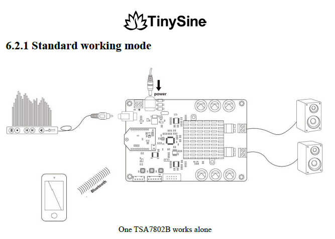

---

## Author

**Joseph Mbode**

Embedded systems, electronics, mechatronics and digital signal processing projects.

- GitHub: [@Josephulrich](https://github.com/Josephulrich)
- LinkedIn: [Joseph Mbode](https://www.linkedin.com/in/joseph-mbode)
